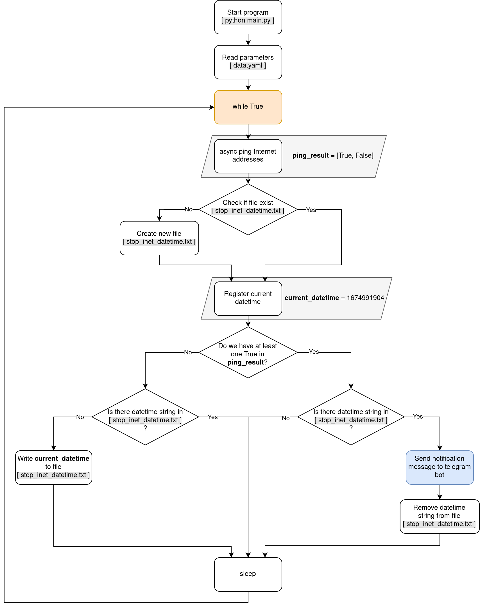

A small script to log periods of time when there is no Internet connection. When the Internet connection is restored, the script sends a text notification to the telegram bot.

**Brief explanation:** Python script performs ping requests for two IP addresses in the loop. When the script fails to register a response from the requested IP addresses, it remembers the crash time and writes it to an external *.txt file. After a while, when the Internet reappears and the script has at least one response from the requested IP address, it notifies the user via the telegram bot.

Example of notification telegram message:


This solution is one part of the personal smart home idea that runs on the Raspberry PI board(s).

## Features

- Ping functionality uses asyncio library - [icmplib](https://github.com/ValentinBELYN/icmplib)
- Script configuration parameters in data.yaml
- Script works with Python 3.7 and higher

Main logic:



## Installation

- Clone or download project from github.

- Create and activate special venv for project:

  ```shell
  $ cd internet_accessibility_checking/
  $ python3.7 -m venv venv
  $ source venv/bin/activate
  ```

- Install required packets to the venv:

  ```shell
  (venv) $ pip install -U pip setuptools wheel
  (venv) $ pip install -r requirements.txt
  ```

- Start the script:

  ```shell
  (venv) $ python main.py
  ```

- Alternative variant of starting:

  ```shell
  $ ./main.py
  ```